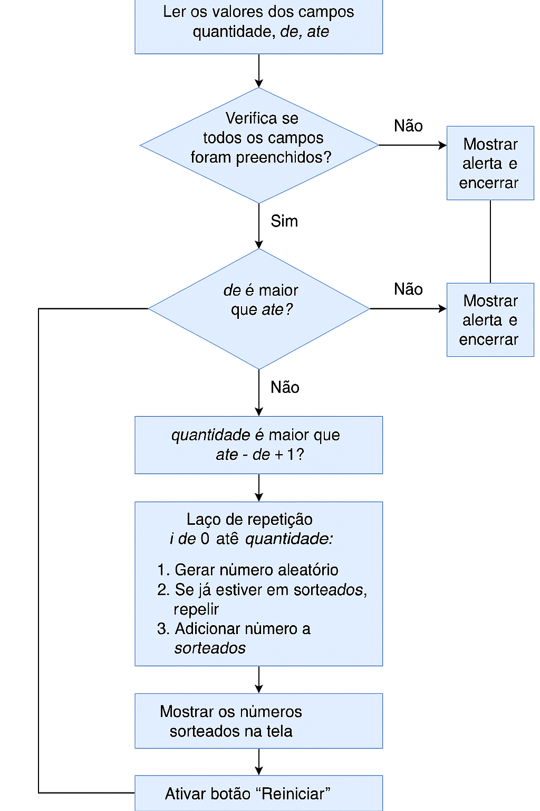

# 🎲 Sorteador de Números Aleatórios

Este projeto é um sorteador de números aleatórios **sem repetição**, feito com HTML, CSS e JavaScript.  
O usuário informa um intervalo (ex: de 1 até 10) e a quantidade de números que deseja sortear.

<p aling="center">
  
</p>

---

## ✅ Funcionalidades

- Geração de números aleatórios sem repetição
- Validação de campos preenchidos
- Alerta para intervalos e quantidades inválidas
- Botão de reinício

---

## 🧭 Passo a Passo de Uso

1️⃣ **Informe quantos números deseja sortear**  
Digite um número no campo **"Quantidade"**.

2️⃣ **Defina o intervalo de números**  
Preencha os campos **"Do número"** e **"Até o número"**.  
Exemplo: de `1` até `10`.

3️⃣ **Clique no botão "Sortear"**  
O programa irá sortear os números aleatórios **sem repetir**.

4️⃣ **Veja o resultado abaixo dos campos**  
Os números sorteados aparecerão como uma lista.

5️⃣ **Clique em "Reiniciar" para começar novamente**

---

<h2 align="center">🎥 Demonstração do Funcionamento</h2>

<p align="center">
  
</p>

## 🗺️ Fluxograma do Funcionamento

<p align="center">
  
</p>

---

## 🚀 Como Executar o Projeto

1. Clone o repositório:
   ```bash
   git clone https://github.com/jvlimadev/sorteador-de-numeros.git 

2. Abra o aquivo index.html no navegador.
   ```bash
   Basta dar duplo clique no arquivo.git.
   Ou use uma extensão como Live Server no VS Code.

## 🛠️ Tecnologias Usadas
- HTML

- CSS

- JavaScript (puro)

## 📄 Licença
Este projeto está sob a licença MIT.
Sinta-se livre para usar, estudar e melhorar!